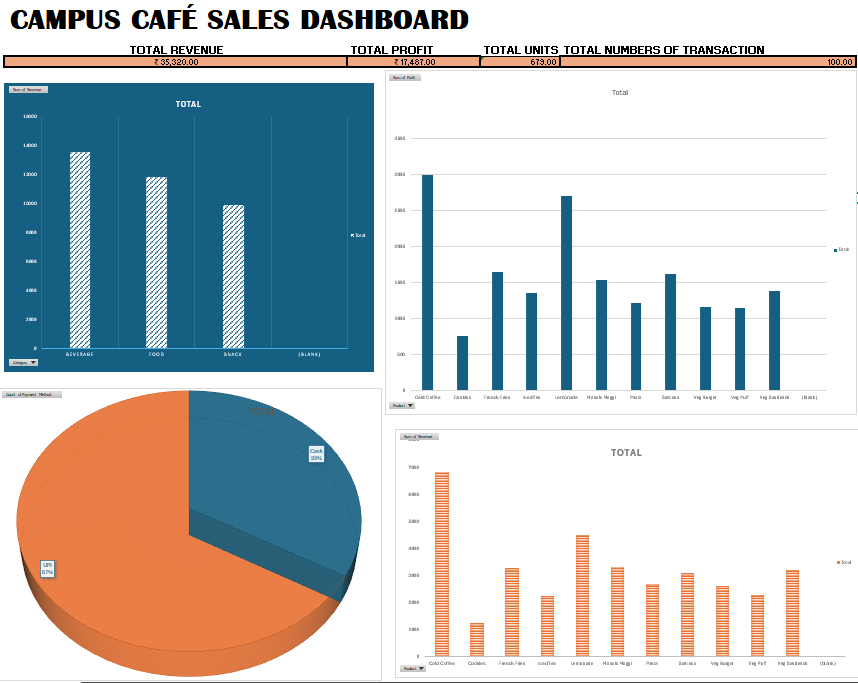

# Campus Café Sales Analysis

## Project Overview
This project analyzes simulated sales transaction data from a campus café to evaluate product performance, category contributions, profitability, and payment preferences.

## Objectives
- Analyze total sales revenue and net profit.
- Identify top-performing products by volume, revenue, and profit.
- Compare revenue across product categories (Beverages, Food, Snacks).
- Understand customer payment method distribution (UPI vs. Cash).

## Dataset Summary
- **Total Transactions:** 100
- **Total Units Sold:** 679
- **Total Revenue:** ₹35,320
- **Total Profit:** ₹17,487
- **Peak Revenue Date:** 18-09-2026

## Tools Used
- **Microsoft Excel**: Data Analysis, Formulas, PivotTables, Dynamic Charts
- **Data Visualization**: Excel Dashboarding
- **Documentation**: GitHub, PDF Report

## Key Findings & Insights
- **Volume vs. Revenue**: Samosa was the highest-volume product sold, but Cold Coffee generated the highest overall revenue and profit, demonstrating that high unit sales do not equal top revenue.
- **Top Category**: Beverages generated the highest revenue among all categories, heavily supported by Cold Coffee and Lemonade sales.
- **Payment Preferences**: UPI was the primary payment method used over Cash, indicating a strong customer preference for digital transactions.
- **Healthy Profit Margin**: The café achieved an overall profit margin of **~49.5%** on total sales.

## Dashboard Preview

## Note
*The dataset used in this project is simulated and created for portfolio and educational purposes.*
